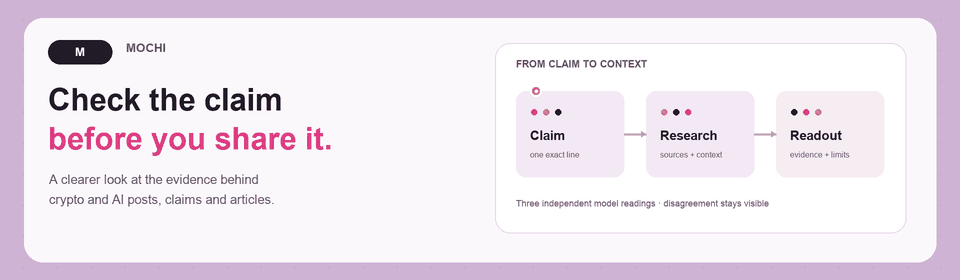

<p align="center">
  <a href="docs/assets/mochi-banner-poster.png"></a>
</p>

<p align="center">
  <a href="LICENSE"></a>
  <a href="LICENSE-docs.md"></a>
  
</p>

<h3 align="center">Check the claim before you share it.</h3>

Mochi helps people inspect claims in crypto and AI posts, articles, and announcements. Give it one exact claim and, if you have them, links to sources. It gathers bounded public evidence, asks three independently configured models to read that same evidence, and lays out their findings, cited passages, limitations, and disagreements. The point is to make the reasoning easier to examine—not to ask you to trust a single confident-sounding answer.

**[Open the claim research preview](https://web-production-fb1a0.up.railway.app/check/)** · Live pilot access is invitation-only; provide public source links. The pilot is unpaid.

## How it works

1. **Choose a claim.** Submit a short, exact statement and public HTTPS source URLs. Mochi asks for consent before external research.
2. **Gather evidence.** It retrieves a limited amount of public HTML or plain text from the supplied links. General web search is not configured for the current invitation pilot.
3. **Compare readings.** Three separately configured models receive the same evidence. Mochi checks that cited passages match the retrieved text and displays each reading, along with uncertainty and disagreement. A split or lack of useful evidence stays unresolved; it is not turned into a majority-backed verdict.
4. **Decide what to do.** Review the evidence and limitations yourself. Sharing a result is a separate, explicit choice.

This first pilot is for researching one claim at a time. It does not extract every claim from a full article, retrieve PDFs or authenticated posts, bypass paywalls, or establish that a source is authentic or that a matching quote proves a claim. Providers receive the claim and evidence as described by the consent in the interface. Do not submit confidential material.

## Current status

The interface is live as an invitation-only research pilot with real model reviews. Its small hand-selected evaluation does not establish model accuracy. The pilot does not take payments. The discussed five-cent target is not a price charged by the current service.

Confidential document review is a separate protocol and is not activated here. This pilot does not run in a trusted execution environment (TEE), publish a chain receipt, or settle anything on-chain. See the [claim research implementation notes](services/claims/README.md) for configuration, data handling, limits, and the checks completed so far.

## Run locally

Requirements: [Bun](https://bun.sh/) and the dependencies declared by this repository. From the repository root:

```sh
bun install --ignore-scripts
bun run typecheck
cd web/site
bun install --frozen-lockfile --ignore-scripts
bun run build
cd ../..
bun web/server.ts
```

Then open `http://localhost:4321/check/` (or the local URL printed by the server). The local interface remains disabled unless server-side pilot settings and providers are configured. Keep provider credentials out of the browser and repository; use the hosting environment as described in the [configuration guide](services/claims/README.md). Local browser fixtures use synthetic findings and are not a quality benchmark.

## Project notes

This public export includes the broader Mochi contracts and packages as well as the claim research pilot. The research preview is the active user-facing interface; repository components do not imply that every protocol feature is running or available to users. The [public history](docs/HISTORY.md) explains how this retrospective 250-commit export was assembled and its limits.

## License and notices

Mochi source code is licensed under [PolyForm Noncommercial 1.0.0](LICENSE). Documentation and media are licensed under [CC BY-NC 4.0](LICENSE-docs.md). **The project is source-available under noncommercial terms; it is not open source under the OSI definition.** Commercial use requires a separate license. Third-party components retain their own terms; see [NOTICE.md](NOTICE.md). For vulnerability reports, see [SECURITY.md](SECURITY.md).
